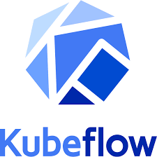
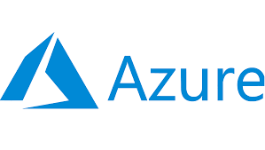

### Hi there, I'm Jyothish CHANDRASENAN 👋

  
&nbsp; 

- 🔭 I’m a Master's Graduate in Data Science and Analytics
- 💪 Strengths: Machine Learning, Deep Learning, MLOPs

 ---
  

  <b>My GitHub Stats</b> 
    
    
    
  
                  <b>⚡ Technologies I use </b>
      

    <table align="center">
        <tr>
            <td align="center" width="140" height="112.43">
                
                  Python
            </td>
            <td align="center" width="140" height="112.43">
                
                  Jupyter
            </td>
            <td align="center" width="140" height="112.43">
                
                  TensorFlow
            </td>
            <td align="center" width="140" height="112.43">
                
                  Pytorch
            </td>
            <td align="center" width="140" height="112.43">
                
                  Scikit Learn
            </td>
            <td align="center" width="140" height="112.43">
                
                  HuggingFace
            </td>
            <td align="center" width="140" height="112.43">
                
                  FastAPI
            </td>
            <td align="center" width="140" height="112.43">
                
                  Docker
            </td>
            <td align="center" width="140" height="112.43">
                
                  Kubeflow
            </td>
            <td align="center" width="140" height="112.43">
                
                  GCP
            </td>
            <td align="center" width="140" height="112.43">
                
                  Azure
            </td>
        </tr>
    </table>
    

***Thanks for visiting my profile.***

